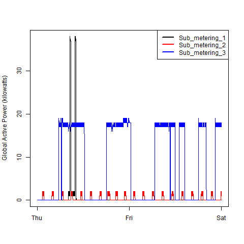
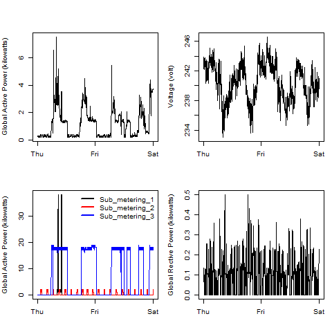

## Generating the plots

1. Download the data set from:  <a href="https://d396qusza40orc.cloudfront.net/exdata%2Fdata%2Fhousehold_power_consumption.zip">Electric power consumption</a> [20Mb]
2. extract zip file and place `household_power_consumption.txt` into this directory
3. start R and set the working directory to this directory
4. run the plot scripts

## Results

### Plot 1

 

### Plot 2

### Plot 3

### Plot 4

